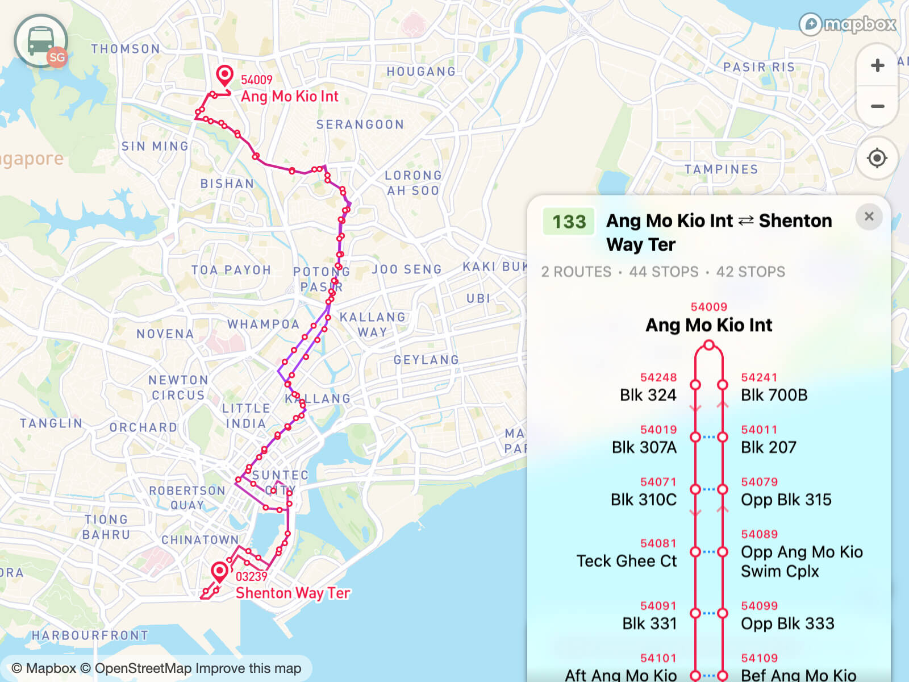
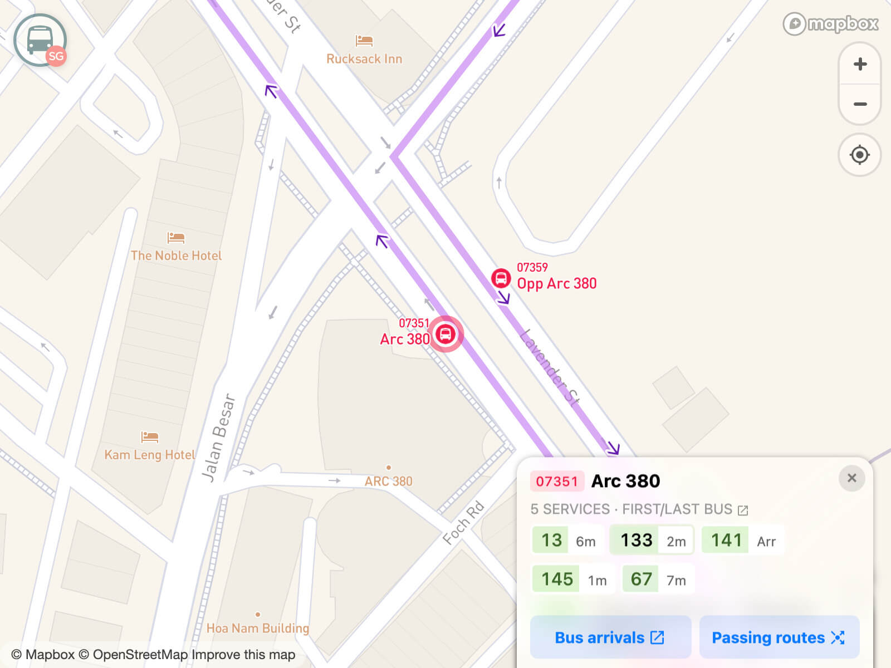
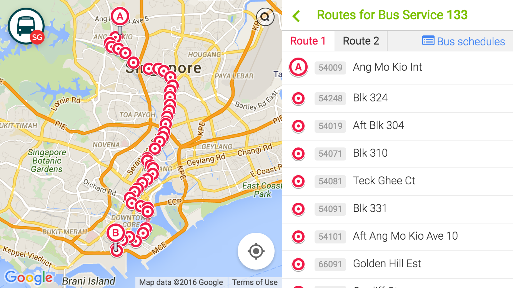
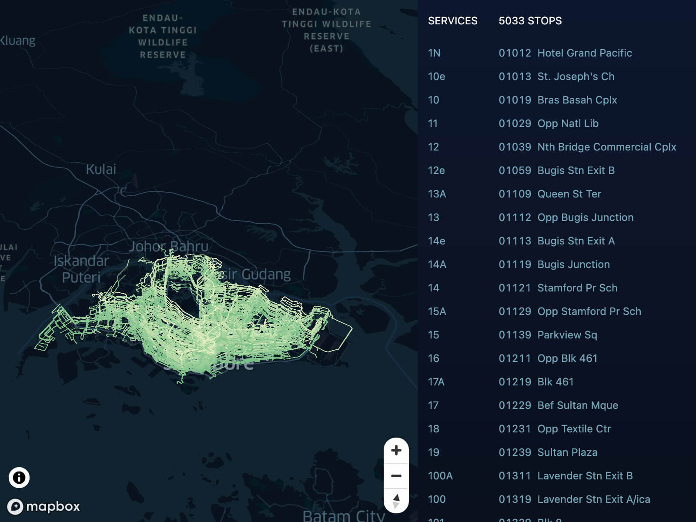

  

  # BusRouter SG

**Singapore Bus Routes Explorer** 🚌 🗺 🇸🇬

Explore bus stops and routes on the map for all bus services in Singapore, with realtime bus arrival times and per-bus-stop passing routes overview.

[**Website**](https://busrouter.sg/) &nbsp;&nbsp;&nbsp; [**Blog Post**](https://cheeaun.com/blog/2019/02/building-busrouter-sg/)

## ✨ Features

- **All** bus stops shown even in low zoom levels.
- **Full routes** display with all stops for every service.
- View all routes **passing through** a stop.
- Bus **arrival times** for every stop.
- **First/last timings** for all services.

## 🕰 Previously

_Previously_ known as Singapore Bus Routes Explorer, abbreviated as 'SBRE' and _previously_ looks like this:

## Visualization mini-site

A separate mini-site showing **ALL** stops and routes on a map. All of them.

Check it out: [Visualization mini-site](https://busrouter.sg/visualization/) (⚠️ Uses a lot of bandwidth).

## Technicalities

### Data

All data such as bus stops, services and routes are mostly _scraped_ from <https://www.lta.gov.sg/>, which means they are copyrighted by the [Land Transport Authority](https://www.lta.gov.sg/content/ltagov/en/terms-of-use.html).

They are available here: [cheeaun/sgbusdata](https://github.com/cheeaun/sgbusdata).

### Web App

The scripts for the web app:

- `npm start` - start server for development
- `npm run build` - build for production and deployment, in `./dist` folder.

### Localization

### Visualization

At least Node.js 14 is required.

The scripts to generate the data, in order:

1. `node visualization/build-routes.mjs`
   - Reads `data.busrouter.sg/v1/data/stops.min.json` and transform routes data with "levels" for 3D extrusion.
   - Generates `visualization/data/routes.json` and `visualization/data/levels.json` to be read by the `build-stops` script.
2. `node visualization/build-stops.mjs`
   - Reads `data.busrouter.sg/v1/data/stops.min.geojson` and _buffered_ into triangle polygons which will be 3D-extruded.
   - Generates `visualization/data/stops.3d.json`.

## 📜 License

Data © [LTA](http://www.mytransport.sg/content/mytransport/home/dataMall/termOfUse.html) © [OneMap](https://www.onemap.sg/legal/termsofuse.html) © [OSM contributors](https://www.openstreetmap.org/copyright). Everything else: [MIT](http://cheeaun.mit-license.org/)

## 🎤 Feedback

If you have any feedback, leave them on [Discussions](https://github.com/cheeaun/busrouter-sg/discussions) or tweet me [@cheeaun on Twitter](http://twitter.com/cheeaun).

## 🙇‍ Credits

- Inspired by [this tweet](https://twitter.com/mengwong/status/155511398653362177).
- Icon is from [The Noun Project](http://thenounproject.com/noun/bus/#icon-No97)
- Color scheme initially _inspired_ by [Gothere.sg](http://gothere.sg/)
- Thanks to Eddy Yanto for building the [iPad app](https://github.com/eddyyanto/SGBusRouter) until mid-2015.
