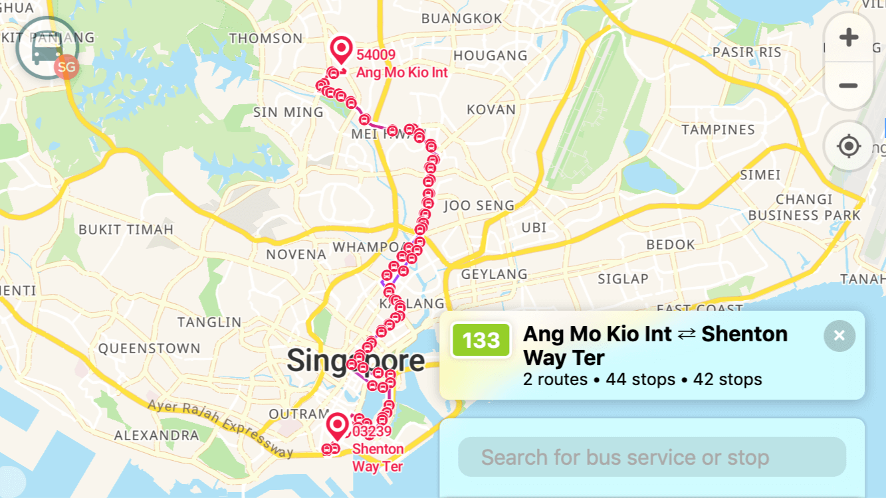
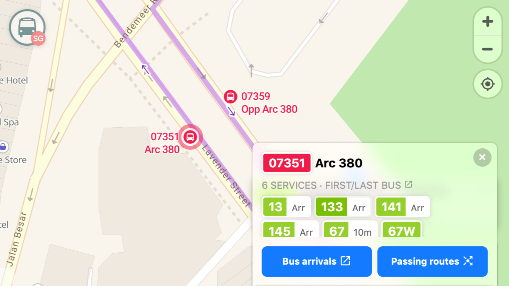

[BusRouter SG](https://busrouter.sg/) - Singapore Bus Routes Explorer
===

> 🚌 🗺 🇸🇬

> Explore bus stops and routes on the map for all bus services in Singapore, with realtime bus arrival times and per-bus-stop passing routes overview.

✨ Complete Feature Set
---

- Show **full route** with all bus stops for every bus service.
- Show **all** bus stops when zoomed in.
- Show all routes that **pass through** one bus stop.
- Show bus **arrival times** for a bus stop.

*Previously* known as Singapore Bus Routes Explorer, abbreviated as 'SBRE' and *previously* looks like this:

🛠 Technicalities
---

All data such as bus stops, services and routes are mostly *scraped* from <http://mytransport.sg/>, which means they are copyrighted by the [Land Transport Authority](http://www.lta.gov.sg/).

[`Node.js`](https://nodejs.org/) is required to run the tasks to scrape data, *massage* the data, and run this web app.

Before running anything, run `npm i` to install all required dependencies.

Notes before diving in:
- There are three important terms: **stop**, **service** and **route**.
- One service have one or many routes, usually maximum two routes. It may be an A-to-B route or A-to-A route (roundtrip).
- Services with two routes may contain A-to-B and B-to-A routes with different list of stops, usually on the opposite sides of the road. Some services may contain A-to-B and C-to-D routes where the first stop of a route may not be the last stop of the 2nd route, etc.

The scripts are:

- `node tasks/fetchServices`
	- Scrapes https://www.mytransport.sg/content/mytransport/map.html
	- Grabs a list of bus services (number, category and number of routes)
	- Generates `services.json`
- `node tasks/fetchServiceStops`
	- Loop through all bus services and scrape `https://www.mytransport.sg/content/mytransport/ajax_lib/map_ajaxlib.getBusRouteByServiceId.{SERVICE_NUMBER}.html`
	- Grabs a list of stops for every service
	- Generates `serviceStops.json`, a mapping of every service to stops, separated by routes.
	- Generates `stops.json`, a list of stops with names and coordinates
- For route polylines (route lines of a service between all stops, containing just a list of coordinates), everything is scraped from their respective sources, ignoring dirty data, in best-effort ways:
	- MyTransport.SG: `node tasks/fetchRoutesMyTransportSG` - most reliable so far, but some lines are kind of weird and overlapping in wrong ways
	- OneMap.SG: `node tasks/fetchRoutesOneMapSG`
	- TowerTransit.SG: `node tasks/fetchRoutesTowerTransitSG` - pretty reliable source
	- Mapbox: `node tasks/fetchRoutesMapboxAPI` - using [Mapbox Directions API](https://www.mapbox.com/api-documentation/#directions) to fill in the blanks, for services that don't have routes.
	- `node tasks/exposeFaultyRoutes` - for exposing routes that may be faulty, which is good for comparing the quality for all sources above.
- For stops, everything is scraped from their respective sources too, to get stop names and (hopefully) accurate coordinates:
	- LTA DataMall: `node tasks/fetchStopsLTA`
	- OneMap.SG: `node tasks/fetchStopsOneMap`
	- OpenStreetMap: `node tasks/fetchStopsOverPass` - data queried via OverPass API, generated with [Overpass Turbo](https://overpass-turbo.eu/)
	- `node tasks/repositionStops` - Generates `stops2.json` with additional stop names and (hopefully) more accurate coordinates
	- `node tasks/repositionStopLabels` - Generates `stops3.json` with adjusted label positionings.
- `node tasks/fetchRoutesLTA`
	- Fetches all routes with stop information for approximate arrival times for first and last buses.
	- The approximate arrival times are for *every single stop*. They are not the first bus that departs from first stop or last bus towards last stop. Every. Single. Stop.
	- Generates `routes.lta.json`, a mapping of all stops to services with approximate arrival times for first and last buses.
- For generating GeoJSON files
	- `node tasks/geojsonRoutes`
	- `node tasks/geojsonStops`
- For generating final JSON files to be consumed by the web app
	- `node tasks/fetchAbbrs`
		- Grab all relevant abbreviations from https://landtransportguru.net/acronyms/ and https://en.m.wikipedia.org/wiki/List_of_Singapore_abbreviations
		- These are used for normalizing stop names
	- `node tasks/generateServices`
		- Service names are dynamically generated from the stops
		- Generates `services.final.json` for usage in web app
	- `node tasks/generateStops`
		- Stop coordinates are rounded to 5-number precision
		- Generates `stops.final.json` for usage in web app
	- `node tasks/generateRoutesPolyline`
		- Line coordinates are lossily compressed with [Encoded Polyline Algorithm Format](https://developers.google.com/maps/documentation/utilities/polylinealgorithm)
		- Generates `routes.polyline.json` for usage in web app
	- `node tasks/generateFirstLast`
		- Approximate arrival times for first and last buses for every service in every single stop
		- Generates `firstlast.final.json` for usage in web app
- For fun
	- `node tasks/trivia` - Trivia questions with answers

**Current version of the data is _3_**, all located under `./data/3` folder. All JSON files are "immutable", in the sense that all scripts above do not modify existing JSON files that are generated by other scripts. Every script is written to only create or modify its own JSON files and should not overwrite other JSON files.

Everything else are older versions of the data and being left there for legacy reasons.

When there's a data update, run the scripts in these order:

1. `node tasks/fetchServices`
2. `node tasks/fetchServiceStops`
3. Stops data
	1. `node tasks/fetchStopsOneMap`
	2. `node tasks/fetchStopsOverpass`
	3. `node tasks/repositionStops`
	4. `node tasks/repositionStopLabels`
4. Routes data
	1. `node tasks/fetchRoutesMyTransport --override`
		- Mutates/updates the routes data because of `override` option
		- Doesn't delete services/routes that are gone
	2. `node tasks/fetchRoutesOneMapSG --override`
		- Mutates/updates the routes data because of `override` option
		- Doesn't delete services/routes that are gone
5. First/last bus data
	1. `node tasks/fetchRoutesLTA`
6. GeoJSON data (not used in web app)
	1. `node tasks/geojsonStops`
	2. `node tasks/geojsonRoutes`
7. Finalized data (used in web app)
	1. `node tasks/fetchAbbrs`
		- To be used for next two scripts.
	2. `node tasks/generateStops`
	3. `node tasks/generateServices`
	4. `node tasks/generateRoutesPolyline`
	5. `node tasks/generateFirstLast`

The scripts for the web app:

- `npm start` - start server for development
- `npm run build` - build for production and deployment, in `./dist` folder.

📜 License
---

Data © [LTA](http://www.mytransport.sg/content/mytransport/home/dataMall/termOfUse.html) © [OneMap](https://www.onemap.sg/legal/termsofuse.html) © [OSM contributors](https://www.openstreetmap.org/copyright). Everything else: [MIT](http://cheeaun.mit-license.org/)

🎤 Feedback
---

If you have any feedback, tweet me at [@cheeaun](http://twitter.com/cheeaun).

🙇‍ Credits
---

- Inspired by [this tweet](https://twitter.com/mengwong/status/155511398653362177).
- Icon is from [The Noun Project](http://thenounproject.com/noun/bus/#icon-No97)
- Color scheme *inspired* by [Gothere.sg](http://gothere.sg/)
- Thanks to Eddy Yanto for building the [iPad app](https://github.com/eddyyanto/SGBusRouter) until mid-2015.